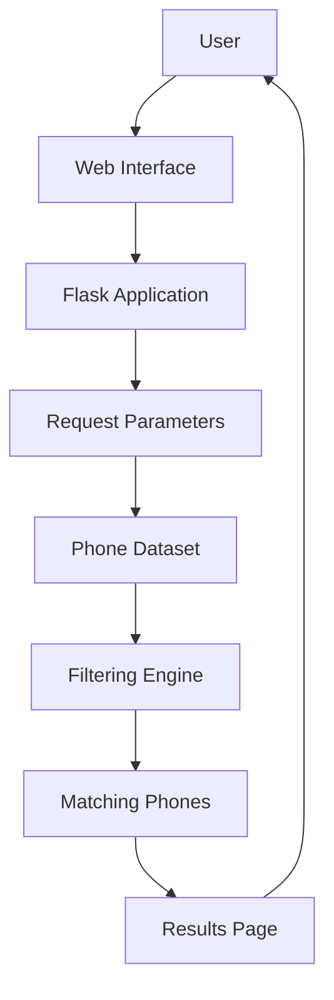

# 📱 Mobile Recommender

### Mobile Phone Recommendation & Filtering Web Application

**Mobile Recommender** is a lightweight web application built with **Python and Flask** that helps users find mobile phones based on their preferred specifications.

The application uses a structured GSM/mobile phone dataset and allows users to submit phone characteristics through a web interface. The backend then filters the available devices and returns matching phones.

---

## 🎯 Overview

Choosing a mobile phone can be difficult when there are many devices with different specifications.

This project provides a simple web-based solution where users can search for phones according to characteristics such as:

* 📱 Brand
* 📲 Model
* 📡 Network technology
* 💾 Memory
* 🖥️ Display
* 📷 Camera
* 🔋 Battery
* ⚡ Performance
* 💰 Price
* 🔌 Connectivity
* 🛰️ GPS
* 📶 Wi-Fi
* 🔵 Bluetooth
* And many other technical specifications

The application reads the phone dataset from a CSV file, processes the user's criteria, and returns the phones matching those criteria.

---

# ✨ Features

## 🔎 Phone Search & Filtering

Users can provide mobile phone characteristics and search the dataset for matching devices.

The application compares the provided values with the available phone specifications.

### Example criteria

```text
Brand
Model
Network Technology
Display Size
OS
CPU
GPU
Internal Memory
Main Camera
Battery
Price
5G Bands
NFC
Wi-Fi
Bluetooth
GPS
```

The dataset contains a large number of technical attributes for each mobile phone.

---

## 📱 Detailed Mobile Specifications

The dataset contains information covering several categories:

### Network

* 2G
* 3G
* 4G
* 5G
* Network speed
* Wi-Fi
* Bluetooth
* GPS

### Hardware

* CPU
* GPU
* Chipset
* Internal memory
* Memory card support
* RAM/memory information

### Display

* Display type
* Display size
* Display resolution
* Display protection

### Camera

* Main camera
* Selfie camera
* Camera features
* Video capabilities
* Multiple camera configurations

### Battery

* Battery capacity
* Charging
* Battery tests
* Talk time
* Standby time

### Other

* Sensors
* SIM
* USB
* NFC
* Radio
* Audio
* Colors
* Body dimensions
* Body weight
* Price

---

# 🧠 Recommendation Logic

The current implementation uses a **rule-based filtering approach**.

The application:

```text
User Criteria
      │
      ▼
Flask Request
      │
      ▼
Load Phone Dataset
      │
      ▼
Compare User Values
      │
      ▼
Find Matching Phones
      │
      ▼
Display Results
```

For each phone, the application checks the submitted criteria against the corresponding fields in the dataset.

A phone is kept when the provided criteria match its stored values.

### Important

This version is a **filtering/matching recommender**, not a machine-learning model.

There is currently no trained neural network, collaborative filtering model, or cosine-similarity model in the implementation.

---

# 🏗️ Architecture



---

# 🛠️ Technology Stack

| Technology  | Purpose                  |
| ----------- | ------------------------ |
| 🐍 Python   | Application development  |
| 🌐 Flask    | Web framework            |
| 📄 HTML     | User interface           |
| 📊 CSV      | Phone dataset            |
| 🚀 Gunicorn | Production WSGI server   |
| ☁️ Procfile | Deployment configuration |

## The repository's `requirements.txt` currently contains Flask and Gunicorn, while the `Procfile` starts the application with Gunicorn using `predictorV2:application`.

# 📁 Project Structure

```text
Mobile-Recommender/
│
├── 📂 templates/
│   ├── index.html
│   └── results.html
│
├── 📄 predictorV2.py
├── 📊 gsm.csv
├── 📦 requirements.txt
├── 🚀 Procfile
└── 📄 README.md
```

---

# 🔧 How It Works

## 1. Dataset Loading

The application reads the `gsm.csv` file when the Flask application starts.

The CSV data is loaded into memory and transformed into dictionaries representing individual phones.

---

## 2. User Input

The user interacts with the web interface and provides mobile phone criteria.

The Flask application receives these values through the `/recommend` endpoint.

---

## 3. Filtering

The application compares each submitted criterion against the corresponding phone attribute.

Conceptually:

```python
if user_value:
    compare(user_value, phone_value)
```

If all provided criteria match, the phone is added to the results.

---

## 4. Results

Matching phones are passed to the results template:

```text
results.html
```

and displayed to the user.

---

# 🚀 Installation

## Prerequisites

Make sure you have:

* Python 3.x
* pip
* Git

---

## 1. Clone the repository

```bash
git clone https://github.com/GABSIWAEL/Mobile-Recommender.git

cd Mobile-Recommender
```

---

## 2. Create a virtual environment

### Windows

```bash
python -m venv venv

venv\Scripts\activate
```

### Linux / macOS

```bash
python3 -m venv venv

source venv/bin/activate
```

---

## 3. Install dependencies

```bash
pip install -r requirements.txt
```

The current project dependencies are Flask and Gunicorn.

---

# ▶️ Run the Application

Start the Flask application:

```bash
python predictorV2.py
```

Then open:

```text
http://127.0.0.1:5000
```

---

# 🚀 Production Deployment

The repository includes a `Procfile` configured to run the application with Gunicorn:

```text
gunicorn predictorV2:application
```

This makes the application suitable for deployment on platforms supporting Procfile-based Python applications.

---

# 📊 Dataset

The project uses:

```text
gsm.csv
```

The dataset contains detailed specifications for mobile phones, including network capabilities, hardware, display, cameras, battery, connectivity, and pricing information.

---

# 💡 Example Use Case

A user could search for phones matching specific characteristics:

```text
Brand: Samsung
OS: Android
Network: 5G
NFC: Yes
Wi-Fi: Yes
Bluetooth: Yes
```

The application searches the dataset and returns phones whose corresponding fields match the submitted criteria.

---

# 🔄 Current Recommendation Approach

```text
                 Mobile Dataset
                       │
                       ▼
                User Preferences
                       │
                       ▼
              Attribute Comparison
                       │
              ┌────────┴────────┐
              │                 │
           Match             No Match
              │                 │
              ▼                 X
       Add to Results
              │
              ▼
        Display Phones
```

---

# 📈 Future Improvements

The current filtering approach can be extended into a more advanced recommendation engine.

### 🤖 Machine Learning

Possible improvements:

* Content-based recommendation
* Cosine similarity
* K-Nearest Neighbors
* Collaborative filtering
* Hybrid recommendation
* Feature engineering
* Recommendation scoring

### 🎯 Personalized Recommendations

Instead of requiring exact matches, the system could rank phones according to user priorities:

```text
Price       → 30%
Performance → 25%
Camera      → 20%
Battery     → 15%
Display     → 10%
```

Then return the highest-scoring phones.

### 📊 Advanced Filtering

Add:

* Price ranges
* Minimum battery capacity
* Minimum RAM
* Minimum camera resolution
* Display size ranges
* 4G/5G filtering
* Brand filtering
* OS filtering

### 📱 Better User Experience

Potential improvements:

* Mobile-responsive UI
* Phone comparison
* Product cards
* Images
* Sorting
* Pagination
* Search autocomplete
* Recommendation scores

### 🚀 Production Improvements

* REST API
* Database instead of CSV
* Docker
* Automated testing
* CI/CD
* Logging
* Monitoring
* API documentation

---

# 🧪 Testing

The current repository is a lightweight Flask application.

For future development, automated tests could cover:

```text
Unit Tests
    │
    ├── Dataset loading
    ├── Filtering logic
    ├── Empty criteria
    ├── Invalid criteria
    └── Multiple criteria

Integration Tests
    │
    ├── Homepage
    ├── Recommendation endpoint
    └── Results page
```

---

# 🔐 Security Considerations

For production deployment, the application should additionally consider:

* Input validation
* Request parameter sanitization
* Production Flask configuration
* Debug mode disabled
* HTTPS
* Rate limiting
* Error handling
* Secure deployment configuration

The current source runs Flask with `debug=True` when executed directly, so debug mode should be disabled in a production environment.

---

# 📚 What This Project Demonstrates

This project demonstrates practical experience with:

* 🐍 Python development
* 🌐 Flask web development
* 📊 CSV data processing
* 🔎 Filtering and search logic
* 🧩 Server-side rendering
* 🌍 HTTP request handling
* 🚀 Gunicorn deployment
* 📦 Dependency management
* 📱 Mobile phone data analysis

---

# 🚀 Future Vision

The long-term goal could be to transform this project from a simple filtering application into a **smart mobile recommendation platform**.

```text
                    User
                     │
                     ▼
              User Preferences
                     │
                     ▼
            Recommendation Engine
                     │
        ┌────────────┼────────────┐
        ▼            ▼            ▼
     Content      Similarity    Ranking
     Features      Model        Model
        │            │            │
        └────────────┼────────────┘
                     ▼
             Personalized Ranking
                     │
                     ▼
              📱 Recommended Phones
```

---

# 👨‍💻 Author

## Wael Gabsi

Software Engineer

Interested in:

* Backend Development
* Full-Stack Development
* Artificial Intelligence
* Machine Learning
* Data & Recommendation Systems
* Software Architecture
* DevOps

---

# ⭐ Project

If you find this project useful or interesting, consider giving it a ⭐ on GitHub.

**Repository:**
https://github.com/GABSIWAEL/Mobile-Recommender

---

## 📄 License

No explicit license is currently included in the repository.
